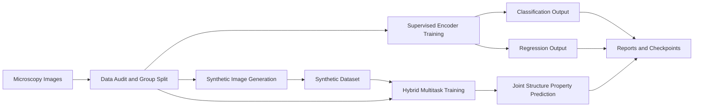
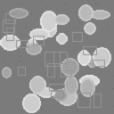
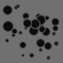
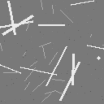

# Microscopy CV Research

Research-structured computer vision project for microscopic images with three connected tracks:

1. Supervised learning with pretrained encoders for microscopy-style images
2. Synthetic data generation for balancing, augmentation, and stress testing
3. Hybrid learning that combines classification, regression, and synthetic mixing

## Framework



## Quick Showcase

See the full portfolio-style page here: [SHOWCASE.md](SHOWCASE.md)

See the real benchmark target map here: [reports/real_benchmark_portfolio.md](reports/real_benchmark_portfolio.md)


## What This Project Does

- builds a 1,440-image microscopy-style starter dataset with specimen-level grouping
- trains supervised classification and regression baselines
- generates synthetic microscopy-like images for augmentation studies
- runs a hybrid multitask model with classification plus regression outputs
- supports public-dataset showcase collection from external microscopy sources

## Reality Check

The current tracked benchmark is still a starter benchmark built to verify the training framework. It is not yet comparable to NASA MicroNet-style microscopy transfer-learning results or to a real SEM, TEM, or EBSD evaluation suite.

What is still missing for a research-grade portfolio:
- real SEM segmentation or defect-analysis testing
- real TEM or EMPIAR-derived encoder transfer evaluation
- real EBSD indexing, phase, or orientation prediction
- qualitative test panels with real input images and predicted outputs

## Runnable Entry Points

```powershell
C:/Users/ghans/AppData/Local/Programs/Python/Python312/python.exe scripts/create_sample_dataset.py
C:/Users/ghans/AppData/Local/Programs/Python/Python312/python.exe scripts/run_supervised.py --config configs/supervised_classification.json
C:/Users/ghans/AppData/Local/Programs/Python/Python312/python.exe scripts/run_supervised.py --config configs/supervised_regression.json
C:/Users/ghans/AppData/Local/Programs/Python/Python312/python.exe scripts/run_synthetic.py
C:/Users/ghans/AppData/Local/Programs/Python/Python312/python.exe scripts/run_hybrid.py
C:/Users/ghans/AppData/Local/Programs/Python/Python312/python.exe scripts/build_public_showcase.py
C:/Users/ghans/AppData/Local/Programs/Python/Python312/python.exe scripts/build_benchmark_portfolio.py
```

## Current Benchmark Results

| Track | Output | Result |
|---|---|---|
| Supervised classification | accuracy | 1.0000 |
| Supervised classification | macro F1 | 1.0000 |
| Supervised regression | MAE | 0.0414 |
| Supervised regression | RMSE | 0.0507 |
| Supervised regression | R2 | 0.9678 |
| Hybrid multitask | classification accuracy | 1.0000 |
| Hybrid multitask | classification macro F1 | 1.0000 |
| Hybrid multitask | regression MAE | 0.0328 |
| Hybrid multitask | regression RMSE | 0.0395 |
| Hybrid multitask | regression R2 | 0.9804 |
| Synthetic generation | generated images | 120 |

## Example Images

### Starter Dataset Samples

| Grain | Pore | Crack |
|---|---|---|
|  |  |  |

### Synthetic Generation Samples

| Synthetic Grain | Synthetic Pore | Synthetic Crack |
|---|---|---|
|  |  |  |

## Public Microscopy Showcase

The project can also download official public microscopy datasets, extract readable preview images, and validate that the project loader can work on them.

Current local showcase sources:
- BBBC028 Human HT29 Colon-Cancer Cells
- BBBC033 Human Motor Neurons
- BBBC053 Image-Based Profiling MitoCheck

## Real Benchmark Targets

| Modality | Example task | Example benchmark source |
|---|---|---|
| SEM | materials segmentation | NASA benchmark segmentation data |
| SEM | indentation or defect segmentation | Zenodo indentation mark segmentation data |
| TEM | encoder transfer or retrieval | CEM500K / EMPIAR |
| EBSD | phase or orientation prediction | Northwestern simulated EBSD / EBSD-indexing |

The benchmark registry for these targets is tracked in [configs/real_benchmark_targets.json](configs/real_benchmark_targets.json), and the generated portfolio summary is in [reports/real_benchmark_portfolio.md](reports/real_benchmark_portfolio.md).

## Important Note

These results are now much more believable as a framework demonstration because they come from a 1,440-image grouped starter dataset rather than the original tiny set. They are still not a substitute for real scientific validation on public or private SEM, TEM, and EBSD datasets.
