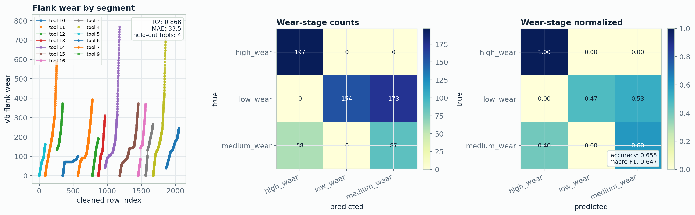
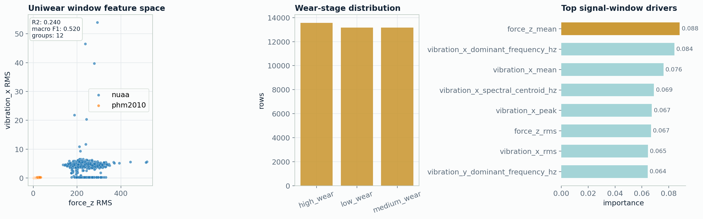
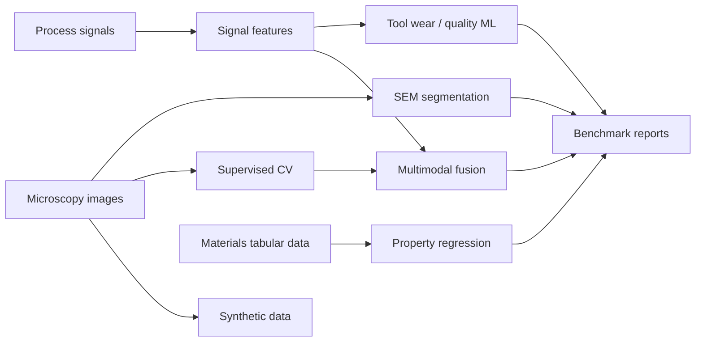

# MatSci-AI Benchmark Platform


**A materials-AI research portfolio connecting microscopy computer vision, high-frequency process-signal analysis, materials-property prediction, and multimodal machine learning.**

This repository is designed as a shareable CV/project link for roles in materials informatics, ML engineering, computer vision, manufacturing analytics, process monitoring, and scientific AI.

## Executive Snapshot

| Area | What it demonstrates | Evidence |
|---|---|---|
| Microscopy CV | SEM segmentation, active learning, synthetic microscopy data, pretrained encoders | [SEM leaderboard](reports/sem_leaderboard.md) |
| Process-signal ML | force, vibration, acoustic/tool-wear style data, grouped validation | [Vicomtech report](reports/external_tool_wear_vicomtech_report.md), [Uniwear report](reports/external_uniwear_tool_wear_report.md) |
| Materials informatics | composition/process/property regression | [Concrete strength report](reports/external_concrete_strength_report.md) |
| Multimodal ML | microscopy descriptors + process-signal features | [Materials AI report](reports/materials_ai_platform_report.md) |
| Reproducibility | configs, dataset cards, benchmark runner, tests, generated reports | [Dataset cards](docs/datasets.md), [Leaderboard](reports/materials_ai_leaderboard.md) |

## Headline Results

| Benchmark | Modality | Task | Split strategy | Result |
|---|---|---|---|---|
| Vicomtech tool wear | process sensor features | flank-wear regression | held-out tool IDs | R2 `0.8680` |
| Vicomtech tool wear | process sensor features | wear-stage classification | held-out tool IDs | macro F1 `0.6472` |
| Katulu Uniwear | force/vibration windows | tool-wear regression | held-out experiments | R2 `0.2397` |
| Katulu Uniwear | force/vibration windows | wear-stage classification | held-out experiments | macro F1 `0.5205` |
| Concrete strength | materials tabular | compressive-strength regression | train/test split | R2 `0.8990` |
| NASA EBC SEM suite | microscopy images | semantic segmentation | dataset split | quick-run foreground IoU `0.1174` |

Full table: [reports/materials_ai_leaderboard.md](reports/materials_ai_leaderboard.md)

## What Makes This Project Valuable

- **End-to-end research workflow:** online dataset download, schema validation, cleaning, preprocessing, training, testing, visualization, and reporting.
- **Real online datasets:** Vicomtech tool wear, Katulu Uniwear force/vibration, concrete strength, NASA SEM benchmark data, and optional CoMMonS microscopy target.
- **Materials-science focus:** microstructure images, tool wear, process quality, compressive strength, and structure-process-property reasoning.
- **ML breadth:** computer vision, signal processing, regression, classification, active learning, uncertainty-aware SEM workflows, and multimodal fusion.
- **Portfolio readability:** every benchmark has a config, script, generated metrics, report, and figure.

## Visual Evidence

### Materials Process Signals


### External Tool-Wear Benchmark



### External Force/Vibration Benchmark



### Materials Property Prediction


### SEM Segmentation


## System Architecture



## Repository Map

| Path | Purpose |
|---|---|
| `configs/` | Reproducible experiment configs for each benchmark |
| `scripts/run_all_benchmarks.py` | Compact benchmark runner for the platform |
| `scripts/run_external_tool_wear.py` | Vicomtech tool-wear extraction, cleaning, training, reporting |
| `scripts/run_external_uniwear.py` | Katulu Uniwear time-window feature extraction and modeling |
| `scripts/run_external_concrete.py` | Concrete compressive-strength materials-property benchmark |
| `scripts/run_sem_suite.py` | Multi-dataset SEM segmentation benchmark |
| `src/microscopy_cv_research/signals/` | Signal simulation, CSV loading, and feature extraction |
| `src/microscopy_cv_research/training/` | CV, signal, multimodal, and external benchmark training logic |
| `reports/` | Generated metrics, figures, leaderboards, and benchmark summaries |
| `docs/datasets.md` | Dataset cards for all online data sources |

## Quick Start

```powershell
git clone https://github.com/Ghanshyambabariya/microscopy_cv_research.git
cd microscopy_cv_research
python -m pip install -e . pytest timm
python scripts/run_all_benchmarks.py
python -m pytest -q
```

Optional SEM benchmark:

```powershell
python scripts/run_sem_suite.py --config configs/sem_suite.json
```

Optional large CoMMonS microscopy-material benchmark:

```powershell
python scripts/run_external_commons.py --config configs/external_commons_microscopy.json --allow-large-download
```

Note: CoMMonS is treated as an optional large-data target because the sampled archive is about `1.1 GB`.

## Key Reports

- [Materials AI platform report](reports/materials_ai_platform_report.md)
- [Materials AI leaderboard](reports/materials_ai_leaderboard.md)
- [Dataset cards](docs/datasets.md)
- [Vicomtech tool-wear benchmark](reports/external_tool_wear_vicomtech_report.md)
- [Katulu Uniwear benchmark](reports/external_uniwear_tool_wear_report.md)
- [Concrete strength benchmark](reports/external_concrete_strength_report.md)
- [CoMMonS microscopy target](reports/external_commons_microscopy_report.md)
- [SEM comparison table](reports/sem_comparison_table.md)

## Skills Demonstrated

| Category | Evidence in this repo |
|---|---|
| Materials science | SEM, tool wear, process monitoring, concrete strength, structure-process-property framing |
| Computer vision | microscopy classification, regression, segmentation, synthetic image generation |
| Signal analysis | force/vibration/acoustic-style features, spectral bands, RMS, crest factor, grouped evaluation |
| Machine learning | Random Forest baselines, PyTorch CV models, active learning, multimodal fusion |
| Research engineering | dataset validation, leakage-aware splitting, config-driven experiments, generated reports, tests |

## Current Scope And Honesty Notes

- The project includes both **real external datasets** and **simulated starter data**.
- Simulated grinding signals are clearly documented and are intended as a scaffold for future measured sensor data.
- CoMMonS is implemented as an optional large microscopy benchmark, but the archive is not committed because of size.
- SEM quick-run results are smoke-test results; use `configs/sem_suite_benchmark.json` for longer full-data runs.

## Citation-Style Dataset Sources

- Vicomtech: [dataset-machine-tool-wear](https://github.com/Vicomtech/dataset-machine-tool-wear)
- Katulu: [uniwear-dataset](https://github.com/katulu-io/uniwear-dataset)
- Concrete strength mirror: [Machine-Learning-with-R-datasets](https://github.com/stedy/Machine-Learning-with-R-datasets)
- CoMMonS: [CoMMonS microscopic material surface dataset](https://github.com/olivesgatech/CoMMonS)

## Project Identity

**Project ID:** `MATSCI-AI-BENCH`

**Positioning:** A practical materials-AI benchmark platform for microscopy, process signals, and structure-property machine learning.

