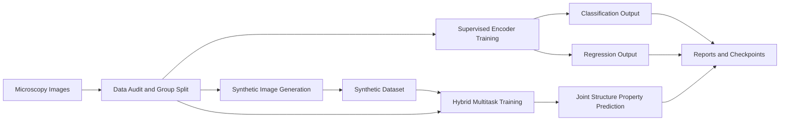
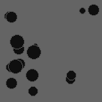
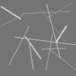
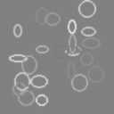
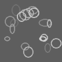
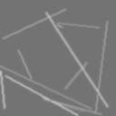

# Microscopy CV Research

Research-structured computer vision project for microscopic images with three connected tracks:

1. Supervised learning with pretrained encoders for microscopy-style images
2. Synthetic data generation for balancing, augmentation, and stress testing
3. Hybrid learning that combines classification, regression, and synthetic mixing

## Framework



## What This Project Does

- builds a microscopy-style sample dataset with class labels and continuous property values
- trains supervised classification and regression baselines
- generates synthetic microscopy-like images for augmentation studies
- runs a hybrid multitask model with classification plus regression outputs
- supports public-dataset showcase collection from external microscopy sources

## Runnable Entry Points

```powershell
C:\Users\ghans\AppData\Local\Programs\Python\Python312\python.exe scripts\create_sample_dataset.py
C:\Users\ghans\AppData\Local\Programs\Python\Python312\python.exe scripts\run_supervised.py --config configs\supervised_classification.json
C:\Users\ghans\AppData\Local\Programs\Python\Python312\python.exe scripts\run_supervised.py --config configs\supervised_regression.json
C:\Users\ghans\AppData\Local\Programs\Python\Python312\python.exe scripts\run_synthetic.py
C:\Users\ghans\AppData\Local\Programs\Python\Python312\python.exe scripts\run_hybrid.py
C:\Users\ghans\AppData\Local\Programs\Python\Python312\python.exe scripts\build_public_showcase.py
```

## Current Showcase Results

These are the current tracked results from the sample microscopy dataset already committed in the repo.

| Track | Output | Result |
|---|---|---|
| Supervised classification | accuracy | 0.3333 |
| Supervised classification | macro F1 | 0.2500 |
| Supervised regression | MAE | 0.2607 |
| Supervised regression | RMSE | 0.3092 |
| Supervised regression | R2 | -1.9232 |
| Hybrid multitask | classification accuracy | 0.0000 |
| Hybrid multitask | classification macro F1 | 0.0000 |
| Hybrid multitask | regression MAE | 0.5312 |
| Hybrid multitask | regression RMSE | 0.5622 |
| Hybrid multitask | regression R2 | -8.6643 |
| Synthetic generation | generated images | 54 |

Detailed outputs:
- `reports/supervised_classification_metrics.json`
- `reports/supervised_regression_metrics.json`
- `reports/synthetic_generation_report.json`
- `reports/hybrid_metrics.json`

## Example Images

### Realistic Starter Microscopy Samples

| Grain-like | Pore-like | Crack-like |
|---|---|---|
|  |  |  |

### Synthetic Generation Samples

| Synthetic Grain | Synthetic Pore | Synthetic Crack |
|---|---|---|
|  |  |  |

## Public Microscopy Showcase

The project can also download a few official public microscopy datasets, extract readable preview images, and validate that the project loader can work on them.

Current local showcase sources:
- BBBC028 Human HT29 Colon-Cancer Cells
- BBBC033 Human Motor Neurons
- BBBC053 Image-Based Profiling MitoCheck

Generated local showcase artifacts:
- `reports/public_showcase.md`
- `reports/public_showcase_manifest.json`
- `reports/figures/showcase/bbbc028_montage.png`
- `reports/figures/showcase/bbbc033_montage.png`
- `reports/figures/showcase/bbbc053_montage.png`

## Important Note

The current metrics are from a small synthetic starter dataset meant to prove the framework works. The project structure is research-ready, but meaningful scientific performance will come only after replacing the sample data with real microscopy images, real labels, and your actual structure-property logic.
