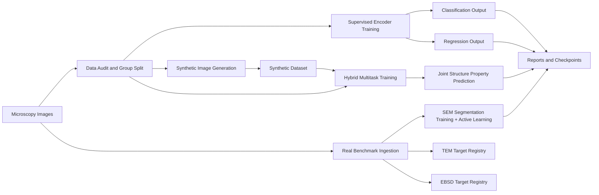

# Microscopy CV Research

Research-structured computer vision project for microscopic images with three connected tracks:

1. Supervised learning with pretrained encoders for microscopy-style images
2. Synthetic data generation for balancing, augmentation, and stress testing
3. Hybrid learning that combines classification, regression, and synthetic mixing

## Framework



## Quick Showcase

See the full portfolio-style page here: [SHOWCASE.md](SHOWCASE.md)

See the real benchmark target map here: [reports/real_benchmark_portfolio.md](reports/real_benchmark_portfolio.md)

See the integrated NASA SEM benchmark showcase here: [reports/real_sem_benchmark_showcase.md](reports/real_sem_benchmark_showcase.md)

See the trained SEM experiment report here: [reports/sem_ebc_segmentation_report.md](reports/sem_ebc_segmentation_report.md)

See the SEM leaderboard here: [reports/sem_leaderboard.md](reports/sem_leaderboard.md)


## What This Project Does

- builds a 1,440-image microscopy-style starter dataset with specimen-level grouping
- trains supervised classification and regression baselines
- generates synthetic microscopy-like images for augmentation studies
- runs a hybrid multitask model with classification plus regression outputs
- supports public-dataset showcase collection from external microscopy sources
- trains a real NASA SEM segmentation baseline with IoU and Dice reporting
- runs an active-learning loop on SEM data with entropy-based acquisition

## Current Reality

The repo now has real microscopy experiments integrated directly into the portfolio:
- NASA EBC SEM segmentation baseline on public benchmark data
- NASA EBC SEM active-learning loop (seed + acquisitions)

What is still missing for a fuller research-grade benchmark suite:
- real TEM or EMPIAR-derived encoder transfer evaluation
- real EBSD indexing, phase, or orientation prediction with sample patterns and metrics
- longer full-data SEM benchmark runs with stronger encoders and repeated seeds

## Runnable Entry Points

```powershell
C:/Users/ghans/AppData/Local/Programs/Python/Python312/python.exe scripts/create_sample_dataset.py
C:/Users/ghans/AppData/Local/Programs/Python/Python312/python.exe scripts/run_supervised.py --config configs/supervised_classification.json
C:/Users/ghans/AppData/Local/Programs/Python/Python312/python.exe scripts/run_supervised.py --config configs/supervised_regression.json
C:/Users/ghans/AppData/Local/Programs/Python/Python312/python.exe scripts/run_synthetic.py
C:/Users/ghans/AppData/Local/Programs/Python/Python312/python.exe scripts/run_hybrid.py
C:/Users/ghans/AppData/Local/Programs/Python/Python312/python.exe scripts/build_public_showcase.py
C:/Users/ghans/AppData/Local/Programs/Python/Python312/python.exe scripts/build_benchmark_portfolio.py
C:/Users/ghans/AppData/Local/Programs/Python/Python312/python.exe scripts/build_real_sem_showcase.py
C:/Users/ghans/AppData/Local/Programs/Python/Python312/python.exe scripts/run_sem_segmentation.py
C:/Users/ghans/AppData/Local/Programs/Python/Python312/python.exe scripts/run_active_sem.py --config configs/active_sem_ebc.json
C:/Users/ghans/AppData/Local/Programs/Python/Python312/python.exe scripts/run_sem_suite.py --config configs/sem_suite.json
C:/Users/ghans/AppData/Local/Programs/Python/Python312/python.exe scripts/run_sem_suite.py --config configs/sem_suite_benchmark.json
```

## Current Benchmark Results

| Track | Output | Result |
|---|---|---|
| Supervised classification | accuracy | 1.0000 |
| Supervised classification | macro F1 | 1.0000 |
| Supervised regression | MAE | 0.0414 |
| Supervised regression | RMSE | 0.0507 |
| Supervised regression | R2 | 0.9678 |
| Hybrid multitask | classification accuracy | 1.0000 |
| Hybrid multitask | classification macro F1 | 1.0000 |
| Hybrid multitask | regression MAE | 0.0328 |
| Hybrid multitask | regression RMSE | 0.0395 |
| Hybrid multitask | regression R2 | 0.9804 |
| Synthetic generation | generated images | 120 |
| NASA EBC SEM baseline | pixel accuracy | 0.9480 |
| NASA EBC SEM baseline | mean IoU foreground | 0.4334 |
| NASA EBC SEM baseline | mean Dice foreground | 0.5293 |
| NASA EBC SEM active (round 1) | mean IoU foreground | 0.1107 |
| NASA EBC SEM active (round 2) | mean IoU foreground | 0.0126 |

## Real Benchmark Evidence

### NASA EBC SEM Segmentation Baseline

- datasets used: `EBC1`, `EBC2`, `EBC3`
- task type: semantic segmentation
- model: `UNetSmall`
- outputs generated: metrics JSON, prediction figure, benchmark report, leaderboard entries

### NASA EBC SEM Active Learning

- seed size 6, acquisition size 4, 2 rounds, entropy selection
- tracked metrics per round in `reports/sem_active_learning_log.json`
- leaderboard entries added for round 1 and round 2


## Public Microscopy Showcase

The project can also download official public microscopy datasets, extract readable preview images, and validate that the project loader can work on them.

Current local showcase sources:
- BBBC028 Human HT29 Colon-Cancer Cells
- BBBC033 Human Motor Neurons
- BBBC053 Image-Based Profiling MitoCheck

## Real Benchmark Targets

| Modality | Example task | Current status |
|---|---|---|
| SEM | materials segmentation | real trained benchmark + active loop |
| TEM | encoder transfer or retrieval | target registry only |
| EBSD | phase or orientation prediction | target registry only |

The benchmark registry for these targets is tracked in [configs/real_benchmark_targets.json](configs/real_benchmark_targets.json), the generated target summary is in [reports/real_benchmark_portfolio.md](reports/real_benchmark_portfolio.md), the integrated SEM showcase is in [reports/real_sem_benchmark_showcase.md](reports/real_sem_benchmark_showcase.md), the trained SEM experiment is in [reports/sem_ebc_segmentation_report.md](reports/sem_ebc_segmentation_report.md), and the SEM leaderboard is in [reports/sem_leaderboard.md](reports/sem_leaderboard.md).

## Important Note

The synthetic starter results are still framework-level results, not publishable microscopy evidence. SEM now includes a real trained benchmark and an active-learning loop; TEM and EBSD remain planned integrations.

## QA & CI
- Run `pytest -q` for fast loader/class-weight checks (runs without datasets).
- GitHub Actions workflow `.github/workflows/ci.yml` runs tests on pushes/PRs.

## SEM Suite Outputs
- Running `python scripts/run_sem_suite.py` now also saves qualitative grids to `reports/figures/sem_suite_<dataset>.png`, noted in the leaderboard.
- Use `configs/sem_suite.json` for a fast smoke test and `configs/sem_suite_benchmark.json` for a longer full-data benchmark run.

