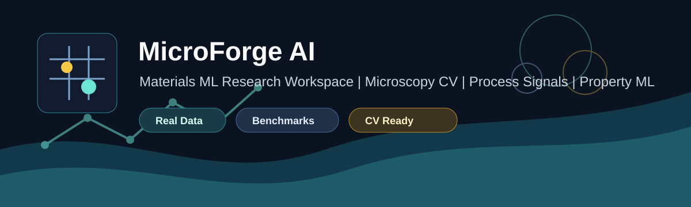

<p align="center">
  
</p>

<p align="center">
  
  
  
</p>

# MicroForge AI: Materials Intelligence Portfolio

Research-grade materials-AI portfolio connecting **microscopy computer vision**, **manufacturing signal analysis**, **tool-wear prediction**, **materials-property ML**, and **multimodal benchmark automation**.

The repository is intentionally split into five clean portfolio projects. Each folder has its own README, result figures, benchmark evidence, and run commands.

## Reviewer View

| Reviewer | What They Should Notice First |
|---|---|
| Professor / research supervisor | honest dataset labeling, leakage-aware validation, reproducible configs, and clear research upgrade path |
| Technical hiring manager | end-to-end ML pipelines: data ingestion, cleaning, features, models, metrics, reports, and tests |
| HR / recruiter | five clean role-specific projects with visual results and a one-line CV story |

Reviewer guide: [docs/reviewer_guide.md](docs/reviewer_guide.md)

## Choose A Project

| Project | What It Shows | Best Evidence | Role Fit |
|---|---|---|---|
| [01 Microscopy CV](projects/01_microscopy_cv) | SEM segmentation, active learning, synthetic microscopy data | NASA EBC SEM predictions and IoU baseline | CV research, microscopy AI |
| [02 Process Signal ML](projects/02_process_signal_ml) | `Fx`, `Fy`, `Fz`, `Mz` feature engineering for grinding-style signals | 20 kHz signal features and process-quality model | manufacturing ML, sensor analytics |
| [03 Tool-Wear Benchmarks](projects/03_tool_wear_benchmarks) | Real machining datasets with grouped validation | Vicomtech R2 `0.8680`, Uniwear macro F1 `0.5205` | predictive maintenance, machining AI |
| [04 Materials Property ML](projects/04_materials_property_ml) | Structure/property regression from tabular materials data | concrete strength R2 `0.8990` | materials informatics |
| [05 Multimodal Platform](projects/05_multimodal_platform) | Unified benchmark reports, dataset cards, and recruiter summary | portfolio leaderboard and generated reports | ML engineering, research portfolio |

## Headline Results

| Benchmark | Task | Validation | Result |
|---|---|---|---|
| Vicomtech tool wear | flank-wear regression | held-out tool IDs | R2 `0.8680` |
| Vicomtech tool wear | wear-stage classification | held-out tool IDs | macro F1 `0.6472` |
| Katulu Uniwear | wear-stage classification | held-out experiment tags | macro F1 `0.5205` |
| Concrete strength | compressive-strength regression | random train/test split | R2 `0.8990` |
| NASA EBC SEM suite | segmentation smoke test | held-out images | foreground IoU `0.1174` |

Full leaderboard: [reports/materials_ai_leaderboard.md](reports/materials_ai_leaderboard.md)

## Repository Map

```text
projects/                  Clean project folders for CV/recruiter review
src/                       Shared reusable Python package
scripts/                   Download, clean, train, evaluate, and report commands
configs/                   Dataset and benchmark configurations
reports/                   Generated metrics, leaderboards, and benchmark summaries
docs/                      Dataset cards, methodology, CV summary, and roadmaps
tests/                     Smoke tests for data, models, and benchmark scripts
```

## Quick Start

```powershell
git clone https://github.com/Ghanshyambabariya/microscopy_cv_research.git
cd microscopy_cv_research
python -m pip install -e . pytest timm
python scripts/run_all_benchmarks.py
python -m pytest -q
```

## Best Links For A CV

- Portfolio entry point: [README.md](README.md)
- CV share wording: [docs/cv_share_link.md](docs/cv_share_link.md)
- Reviewer guide: [docs/reviewer_guide.md](docs/reviewer_guide.md)
- Project index: [projects/README.md](projects/README.md)
- Recruiter summary: [docs/recruiter_summary.md](docs/recruiter_summary.md)
- Dataset cards: [docs/datasets.md](docs/datasets.md)
- Methodology: [docs/methodology.md](docs/methodology.md)

## Positioning

`MICROFORGE-AI` is designed as a clean proof of materials-AI capability: real datasets where available, honest baseline metrics, leakage-aware validation, reproducible scripts, and clear next research upgrades.
