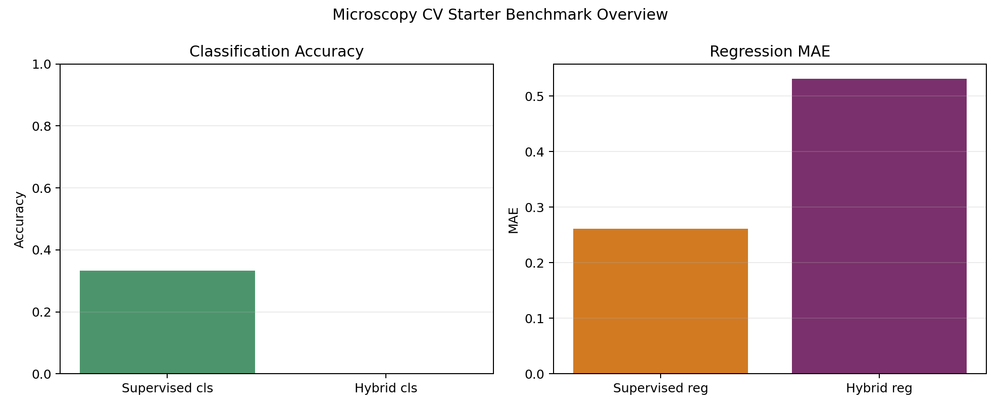
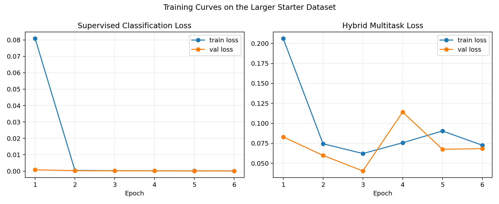
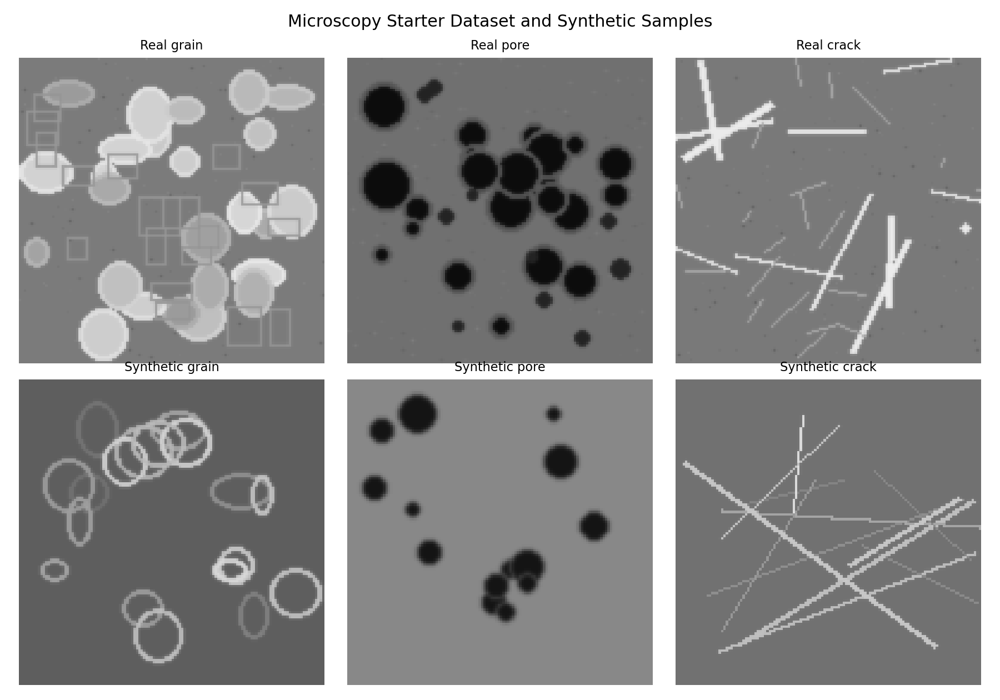
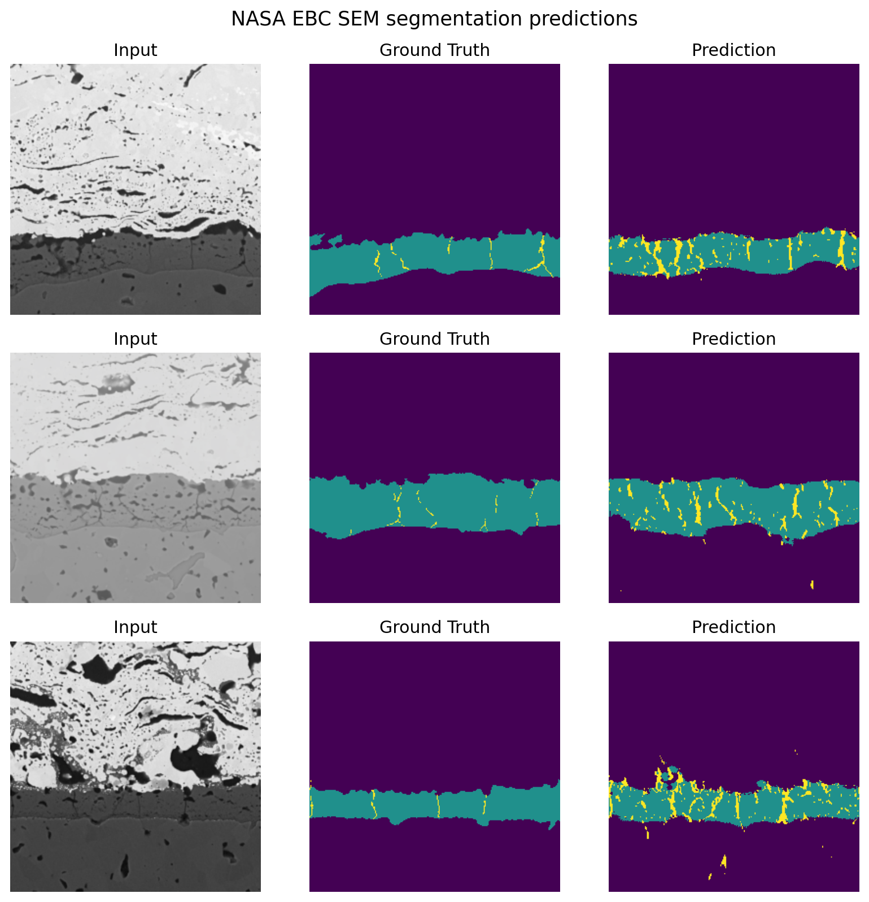

# Showcase

This page is a quick portfolio-style view of the project.

## Framework

- Supervised encoder training for microscopy classification and regression
- Synthetic image generation for augmentation and stress testing
- Hybrid multitask learning for structure-property prediction
- Public microscopy dataset ingestion showcase
- Real benchmark portfolio planning for SEM, TEM, and EBSD work
- Integrated NASA SEM segmentation baseline with real benchmark samples and metrics

## Benchmark Snapshot

The starter dataset contains 1,440 tracked microscopy-style images across 180 specimen groups, and the repo now also includes a real SEM segmentation experiment from NASA MicroNet benchmark data.

| Track | Metric | Value |
|---|---|---|
| Supervised classification | Accuracy | 1.0000 |
| Supervised classification | Macro F1 | 1.0000 |
| Supervised regression | MAE | 0.0414 |
| Supervised regression | RMSE | 0.0507 |
| Supervised regression | R2 | 0.9678 |
| Hybrid classification | Accuracy | 1.0000 |
| Hybrid classification | Macro F1 | 1.0000 |
| Hybrid regression | MAE | 0.0328 |
| Hybrid regression | RMSE | 0.0395 |
| Hybrid regression | R2 | 0.9804 |
| Synthetic generation | Images created | 120 |
| NASA EBC SEM | Pixel accuracy | 0.9480 |
| NASA EBC SEM | Mean IoU foreground | 0.4334 |
| NASA EBC SEM | Mean Dice foreground | 0.5293 |

## Visual Summary

## What Is Real Now

The portfolio now contains one real microscopy benchmark experiment:
- NASA MicroNet EBC SEM segmentation baseline
- real benchmark image and mask pairs
- trained model outputs on test images
- real IoU and Dice metrics
- generated prediction figure with ground-truth and predicted masks

See [reports/sem_ebc_segmentation_report.md](reports/sem_ebc_segmentation_report.md) for the experiment report.

## What Is Still Missing

- TEM benchmark testing with real task outputs
- EBSD benchmark testing with real pattern data and metrics
- stronger cross-encoder microscopy comparisons

See [reports/real_benchmark_portfolio.md](reports/real_benchmark_portfolio.md) for the full benchmark target map.

## Notes

This repo is no longer only a synthetic framework showcase. It now contains a real SEM benchmark experiment, but TEM and EBSD are still target integrations rather than completed evaluated tasks.
