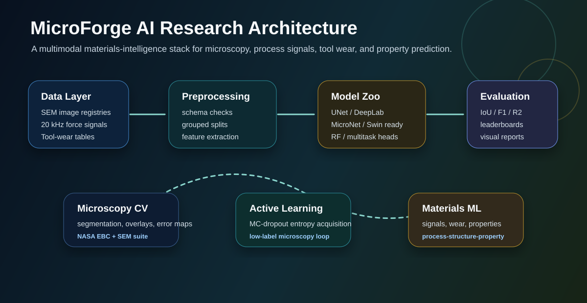
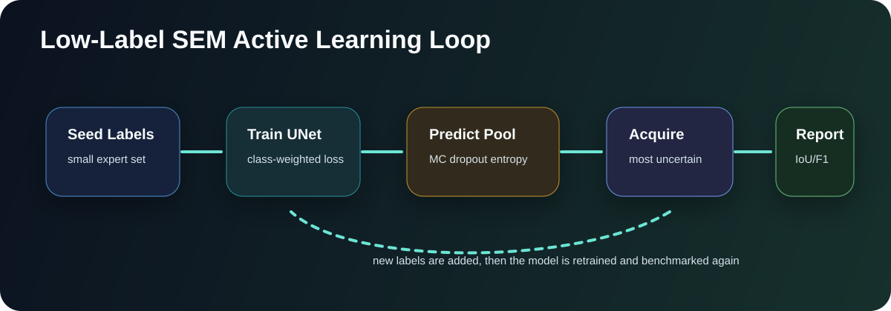
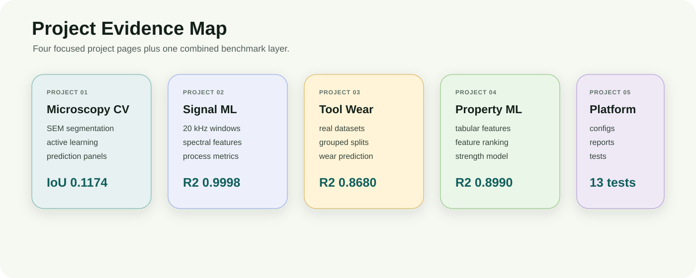

# System Design

MicroForge AI is structured as a research-engineering system, not only a collection of experiments. The goal is to make each dataset runnable while keeping the architecture extensible for stronger encoders, active learning, and multimodal materials modeling.

## Main Code Structure

| System Part | Implementation Evidence | Why It Matters |
|---|---|---|
| Encoder registry | `src/microscopy_cv_research/models/encoder_registry.py` | Keeps MicroNet, Cytoself, UNI, TITAN, DINOv2, ConvNeXt, and ResNet options organized for benchmark comparison. |
| Segmentation model factory | `src/microscopy_cv_research/models/segmentation.py` | Supports UNet, DeepLab, Swin/timm features, and MicroNet-backed DeepLab fallback logic. |
| Active learning loop | `src/microscopy_cv_research/training/active_sem.py` | Uses predictive entropy with Monte Carlo dropout to select the most uncertain SEM images for labeling. |
| Signal feature engine | `src/microscopy_cv_research/signals/features.py` | Extracts RMS, peak, crest factor, spectral centroid, bandpower, resultant force, and energy features from high-frequency force channels. |
| Grouped validation | `src/microscopy_cv_research/data/splits.py` | Reduces leakage by splitting tool-wear datasets by tool ID or experiment where possible. |
| Benchmark automation | `scripts/run_all_benchmarks.py` | Runs the project as a reproducible benchmark suite instead of one-off notebooks. |

## Active Learning Workflow

This workflow is especially important for microscopy because labels are expensive. The system starts with a small seed set, trains a segmentation model, estimates uncertainty on the unlabeled pool, selects the most informative images, and retrains after labeling.

## Project Map

## Design Notes

- It separates data configs, reusable source code, runner scripts, generated reports, and short project folders.
- It can accept new SEM/TEM/EBSD datasets through registries instead of rewriting the whole pipeline.
- It supports a realistic path from baseline models to pretrained microscopy encoders and transformer backbones.
- It keeps current limitations visible instead of hiding baseline results.

## Experiment Tracking Design

The experiment tracking design stores each run as a versioned card: dataset hash, config, split seed, model name, metrics, figures, and failure examples.
