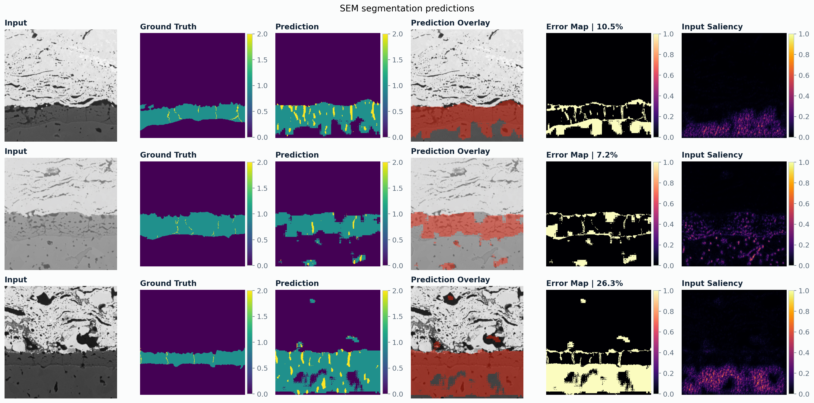

# 01. Scientific Microscopy Segmentation & Explainable Computer Vision

[Back to project index](../README.md) | [Back to main README](../../README.md)

This project trains and evaluates segmentation models for SEM microscopy images. The current benchmark uses the publicly available NASA EBC SEM segmentation data from the NASA pretrained microscopy models repository. The images are not proprietary and were not personally acquired.

## Why Used

SEM segmentation is useful when microstructural regions need to be separated consistently across images. The workflow keeps the model small enough to retrain locally while still reporting pixel-level metrics and visual evidence.

## How Used

- loaded NASA EBC SEM image/mask data from `EBC1`, `EBC2`, and `EBC3`
- trained U-Net and compact FCN segmentation baselines on the same split
- used class weighting because the minority foreground class is much smaller than the background class
- evaluated pixel accuracy, foreground IoU, Dice/F1, precision, and recall
- generated prediction panels with original SEM image, ground truth, prediction, overlay, error map, and input-gradient saliency
- kept entropy-based active learning as a separate loop for low-label experiments

## Final Results

| Dataset | Model | Train / Val / Test | Pixel Accuracy | Foreground IoU | Dice/F1 | Precision | Recall |
|---|---|---:|---:|---:|---:|---:|---:|
| NASA EBC SEM | U-Net small | 37 / 9 / 12 | `0.9446` | `0.4388` | `0.5411` | `0.5053` | `0.7485` |
| NASA EBC SEM | FCN small | 37 / 9 / 12 | `0.8751` | `0.3168` | `0.4362` | `0.3703` | `0.6857` |

The U-Net baseline performs better on this held-out split. The small minority class remains the hardest region to segment, which is visible in the per-class metrics and error maps.

## Explainability

The prediction panel includes input-gradient saliency beside the segmentation outputs. This attribution view is used to inspect which image regions influenced the model response and whether the network is focusing on microstructural boundaries and foreground regions rather than only background contrast.

## Results





Leaderboard: [results/sem_leaderboard.md](results/sem_leaderboard.md)

## Main Files

- `scripts/run_sem_segmentation.py`
- `scripts/run_sem_suite.py`
- `scripts/run_active_sem.py`
- `configs/sem_segmentation_nasa_ebc.json`
- `configs/sem_segmentation_nasa_ebc_fcn.json`
- `src/microscopy_cv_research/models/segmentation.py`
- `src/microscopy_cv_research/training/segmentation.py`

## Run

```powershell
python scripts/run_sem_segmentation.py --config configs/sem_segmentation_nasa_ebc.json
python scripts/run_sem_segmentation.py --config configs/sem_segmentation_nasa_ebc_fcn.json
python scripts/run_active_sem.py --config configs/active_sem_ebc.json
```
