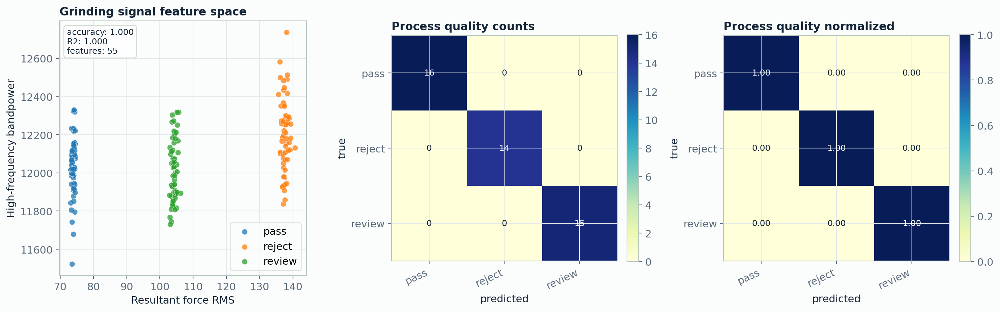

# 02. Materials Process Signal ML

[Back to project index](../README.md) | [Back to portfolio](../../README.md)

High-frequency process-signal workflow for materials manufacturing, built around grinding-style force and torque channels.

> Role fit: manufacturing analytics, signal processing, sensor fusion, process-property ML.

## At A Glance

| Item | Details |
|---|---|
| Data | realistic 20 kHz simulated grinding records for `Fx`, `Fy`, `Fz`, and `Mz` |
| Tasks | process-quality classification and property regression |
| Features | RMS, peak, crest factor, spectral centroid, bandpower, resultant force, energy proxy |
| Current result | process-quality accuracy `1.0000`; property regression R2 `0.9998` |
| Main command | `python scripts/run_materials_signal.py --config configs/materials_signal.json` |

## Result Snapshot

Metrics: [results/materials_signal_metrics.json](results/materials_signal_metrics.json)

## What To Inspect

- `src/microscopy_cv/signal_features.py` for reusable high-frequency feature extraction.
- `scripts/run_materials_signal.py` for simulation, preprocessing, model training, and reporting.
- `configs/materials_signal.json` for sampling rate, channel setup, and benchmark parameters.

## Research Upgrade Path

Replace the simulated signals with measured force, acoustic-emission, vibration, spindle-current, or temperature CSV files, then compare classical feature models against 1D CNN, LSTM, and Transformer windows.
