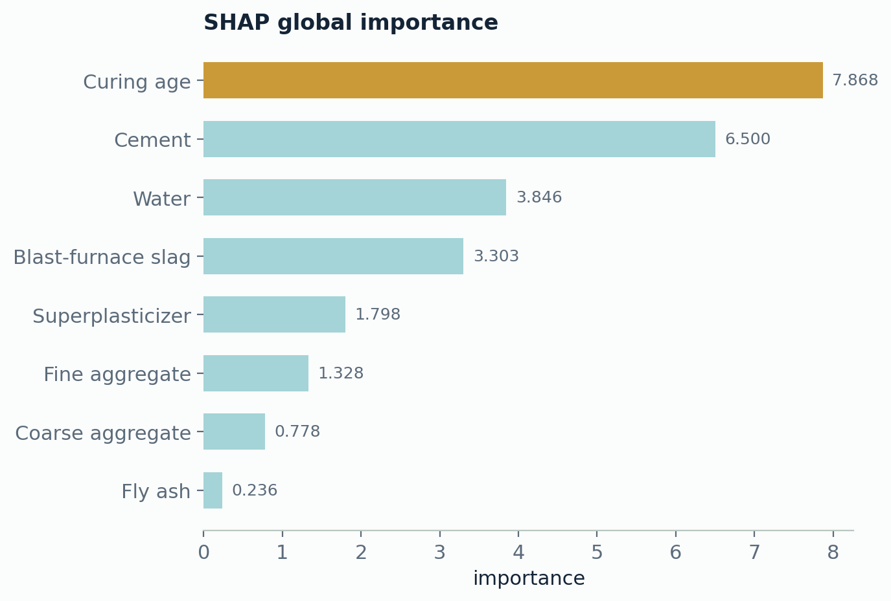
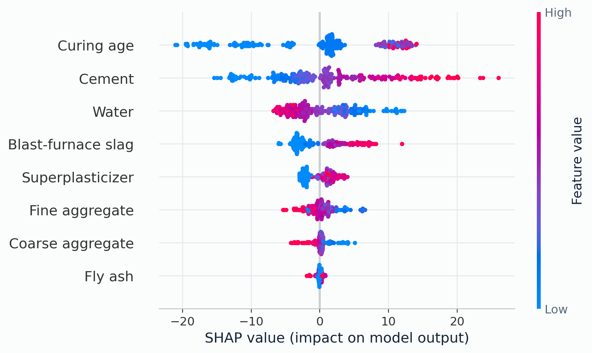
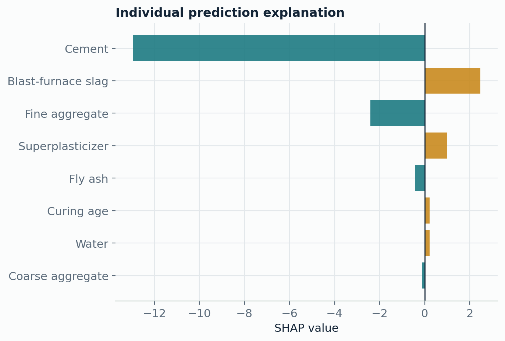

# 04. Materials Property ML

[Back to project index](../README.md) | [Back to main README](../../README.md)

Independent project for material-property regression from tabular composition and process variables.

## Why Used

Many materials problems are tabular before they become image- or sequence-modelling problems. This benchmark uses transparent preprocessing, multiple regression baselines, cross-validation, and SHAP explanations before making stronger model claims.

## How Used

- downloaded the public concrete compressive-strength table
- removed duplicate rows and checked missing values
- split cleaned data into train/test sets with a fixed seed
- compared Ridge regression, Random Forest, and XGBoost
- reported MAE, RMSE, R2, and five-fold cross-validation mean +/- standard deviation
- generated SHAP global importance, beeswarm, and individual prediction explanations for the XGBoost model

## Final Results

| Model | Hold-out MAE | Hold-out RMSE | Hold-out R2 | CV R2 mean +/- std |
|---|---:|---:|---:|---:|
| Ridge | `8.9406` | `11.2337` | `0.5644` | `0.5979 +/- 0.0664` |
| Random Forest | `3.6956` | `5.4103` | `0.8990` | `0.8816 +/- 0.0139` |
| XGBoost | `3.5377` | `4.8951` | `0.9173` | `0.8994 +/- 0.0149` |

XGBoost gives the strongest held-out result in the current run. SHAP ranks curing age, cement, water, slag, and superplasticizer as the dominant contributors.

## Explainability

SHAP is used to inspect both global feature behavior and a single held-out prediction. The goal is to check whether the model follows physically reasonable composition/process trends instead of relying only on opaque feature importance scores.

## Results








Report: [results/external_concrete_strength_report.md](results/external_concrete_strength_report.md)

## Main Files

- `scripts/run_external_concrete.py`
- `configs/external_concrete_strength.json`
- `src/microscopy_cv_research/training/external_concrete.py`
- `docs/structure_property_modelling.md`

## Run

```powershell
python scripts/run_external_concrete.py --config configs/external_concrete_strength.json
```
