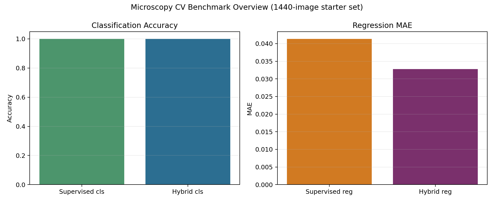

# Project 05: Multimodal Materials AI Platform

**Focus:** connecting microscopy, process signals, and materials-property prediction into one benchmark platform.

This project is the top-level integration layer. It collects the benchmark results, dataset cards, reports, and project automation.

## Why This Project Is Unique

- Connects multiple modalities instead of showing one isolated model.
- Keeps benchmark scripts, configs, generated reports, figures, and dataset cards together.
- Gives a recruiter or research supervisor one clean view of the whole portfolio.
- Supports optional large microscopy datasets without committing huge archives.

## Main Evidence

| Component | Evidence |
|---|---|
| Unified benchmark runner | `scripts/run_all_benchmarks.py` |
| Leaderboard | `reports/materials_ai_leaderboard.md` |
| Dataset cards | `docs/datasets.md` |
| CV-ready summary | `docs/recruiter_summary.md` |

## Results



See:
- [results/materials_ai_leaderboard.md](results/materials_ai_leaderboard.md)
- [results/materials_ai_platform_report.md](results/materials_ai_platform_report.md)

## Run

```powershell
python scripts/run_all_benchmarks.py
python scripts/build_materials_ai_leaderboard.py
python scripts/build_materials_ai_report.py
```

## Next Upgrade

Create a lightweight dashboard or GitHub Pages site that displays the five project cards, figures, and leaderboard interactively.

