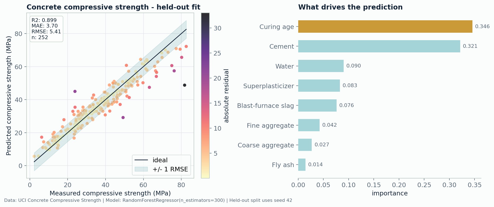

# External Concrete Strength Benchmark

- source: [Concrete Compressive Strength](https://github.com/stedy/Machine-Learning-with-R-datasets)
- cleaned rows: `1005`
- features used: `8`
- train/test split: `753` / `252`

## Results

- compressive-strength MAE: `3.6958`
- compressive-strength RMSE: `5.4098`
- compressive-strength R2: `0.8990`

## Why This Matters

This benchmark tests a compact real property-prediction dataset: ingredient/process variables to mechanical strength.
